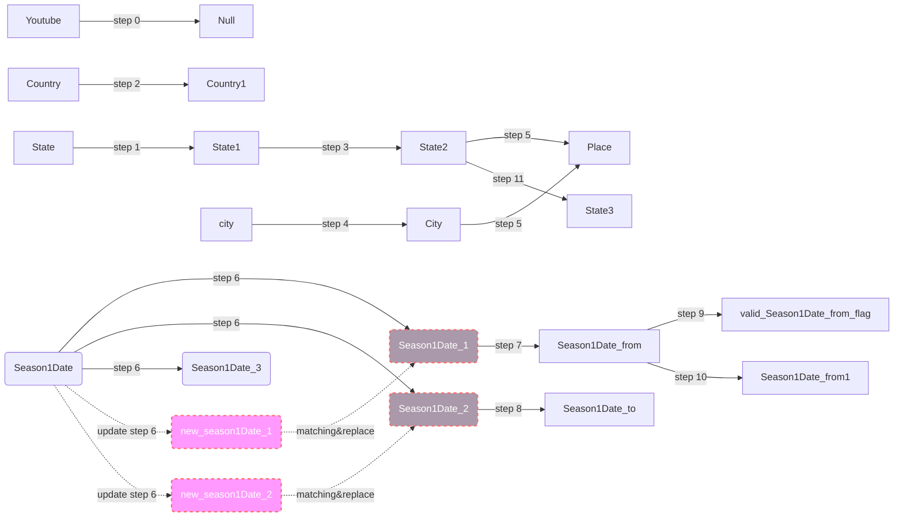

```mermaid
graph LR
   Youtube --> |step 0| Null;
   State --> |step 1| State1;
   Country --> |step 2| Country1;
   State1 --> |step 3| State2;
   city --> |step 4| City;
   State2 & City--> |step 5| Place;
   id1(Season1Date) --> |step 6| id2(Season1Date_1);
   id1(Season1Date) --> |step 6| id3(Season1Date_2);
   id1(Season1Date) --> |step 6| id4(Season1Date_3);
   id1(Season1Date)-. update step 6 .-> id5(new_season1Date_1);
   id1(Season1Date)-. update step 6 .-> id6(new_season1Date_2);
   style id5 fill:#f9f,stroke:#f66,stroke-width:2px,color:#fff,stroke-dasharray: 5 5
   style id6 fill:#f9f,stroke:#f66,stroke-width:2px,color:#fff,stroke-dasharray: 5 5

   id2(Season1Date_1) --> |step 7| Season1Date_from;
   id3(Season1Date_2) --> |step 8| Season1Date_to;
   Season1Date_from --> |step 9| valid_Season1Date_from_flag
   Season1Date_from --> |step 10| Season1Date_from1
   State2 --> |step 11| State3

   id5(new_season1Date_1) -. matching&replace.->id2(Season1Date_1)
   id6(new_season1Date_2) -. matching&replace.->id3(Season1Date_2)
   style id2 fill:#a9a,stroke:#f66,stroke-width:2px,color:#fff,stroke-dasharray: 5 5
   style id3 fill:#a9a,stroke:#f66,stroke-width:2px,color:#fff,stroke-dasharray: 5 5
```