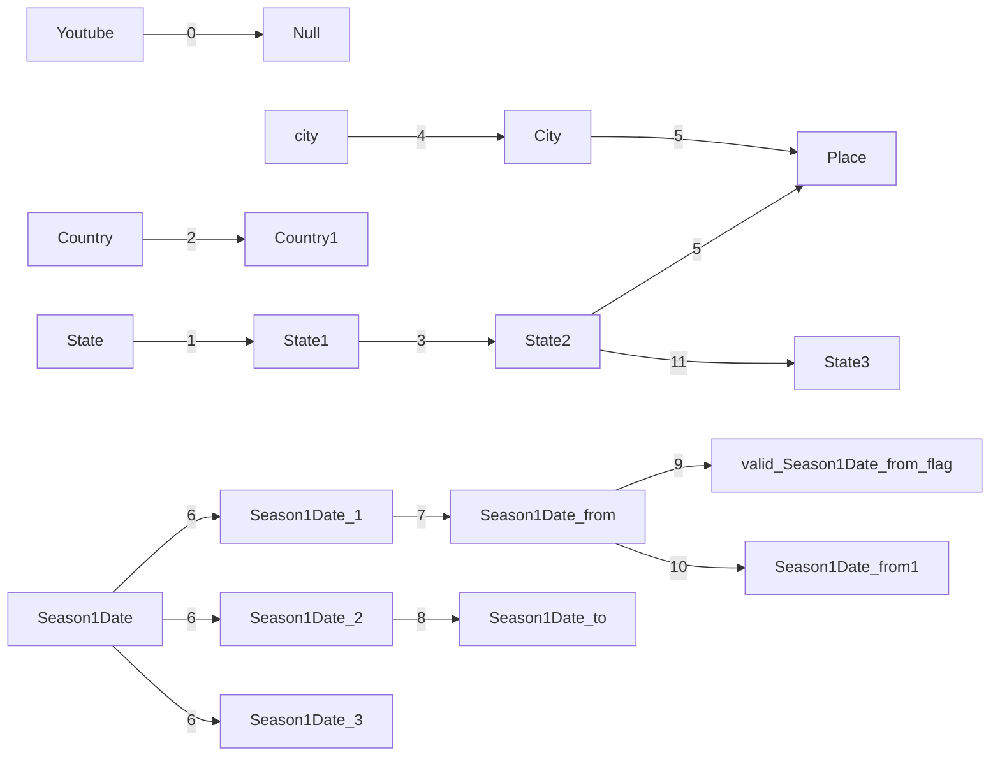

```mermaid
graph LR
   Youtube --> |0| Null;
   State --> |1| State1;
   Country --> |2| Country1;
   State1 --> |3| State2;
   city --> |4| City;
   State2 --> |5| Place;
   City --> |5| Place;
   Season1Date --> |6| Season1Date_1;
   Season1Date --> |6| Season1Date_2;
   Season1Date --> |6| Season1Date_3;
   Season1Date_1 --> |7| Season1Date_from;
   Season1Date_2 --> |8| Season1Date_to;
   Season1Date_from --> |9| valid_Season1Date_from_flag
   Season1Date_from --> |10| Season1Date_from1
   State2 --> |11| State3
```