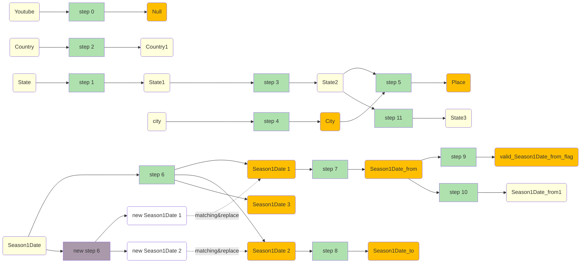

```mermaid

graph LR
   col0(Youtube) --> id0[step 0]
   id0 --> col1(Null);
   style col0 fill:#ffd
   style id0 fill:#afe1af
   style col1 fill:#FFBF00

   col2(State) --> id1[step 1]
   id1[step 1] --> col3(State1);
   style col2 fill:#ffd
   style id1 fill:#afe1af
   style col3 fill:#ffd


   col4(Country) --> id2[step 2]
   id2 --> col5(Country1);
   style col3 fill:#ffd
   style id2 fill:#afe1af
   style col4 fill:#ffd
   style col5 fill:#ffd


   col3 --> id3[step 3]
   id3[step 3] --> col6(State2);
   style id3 fill:#afe1af
   style col6 fill:#ffd


   col7(city) --> id4[step 4]
   id4[step 4]--> col8(City)
   style col7 fill:#ffd
   style id4 fill:#afe1af
   style col8 fill:#FFBF00


   col6 --> id5[step 5]
   id5[step 5] --> col9(Place)
   col8 --> id5[step 5]
   style id5 fill:#afe1af
   style col9 fill:#FFBF00


   col10(Season1Date) --> id6[step 6]
   id6[step 6] --> col11(Season1Date 1)
   id6[step 6] --> col12(Season1Date 2)
   id6[step 6] --> col13(Season1Date 3)
   style id6 fill:#afe1af
   style col10 fill:#ffd
   style col11 fill:#FFBF00
   style col12 fill:#FFBF00
   style col13 fill:#FFBF00

   col11 --> id7[step 7]
   id7[step 7] --> col14(Season1Date_from)
   style id7 fill:#afe1af
   style col14 fill:#FFBF00

   col12 --> id8[step 8]
   id8[step 8] --> col15(Season1Date_to)
   style id8 fill:#afe1af
   style col15 fill:#FFBF00

   col14 --> id9[step 9]
   id9[step 9] --> col16(valid_Season1Date_from_flag)
   style id9 fill:#afe1af
   style col16 fill:#FFBF00

   col14 --> id10[step 10]
   id10[step 10] --> col17(Season1Date_from1)
   style id10 fill:#afe1af
   style col17 fill:#ffd


   col6 --> id11[step 11]
   id11[step 11] --> col18(State3)
   style id11 fill:#afe1af
   style col18 fill:#ffd


   col10(Season1Date) --> id12[new step 6]
   id12 --> col19(new Season1Date 1)
   id12 --> col20(new Season1Date 2)
   style id12 fill:#a9a
   style col19 fill:#fff
   style col20 fill:#fff

   col19 -. matching&replace.->col11
   col20 -. matching&replace.->col12
   
```